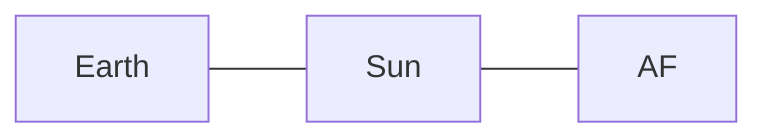

* TOC
{:toc}


Come back to the [lecture](./LRust.md).




## Objective

We would like to represent a space map in Rust.

A space map represents space bodies, linked with space routes:

* A space body can be a star, an asteroid field or a planet. They all have a name.
* An asteroid field has also a resource interest, which can be high, medium or low.
* A planet can be habitable or not. If it is habitable, we have the number of inhabitants. If not, it can be because of the atmosphere, the climate, or the wild fauna.



Your objective is to at least define a star, an asteroid field and a planet (do TASK A, B and C).
If you can, complete also the last section: the space map itself (TASK D).

Returned files:

* You have to answer to the questions via the `protocol.txt` file.
* You will have to copy your project folder `intro-rs` to the final return directory under your ID.

**Do not erase the code you have written in the `main` function. Fix it instead.**






You have two types of blocs:

* task bloc: you need to code
* question bloc: (copied in `protocol.txt`) write the answer in your `protocol.txt` file

Some information and tip blocs are collapsible, they provide to you additional information you can skip.




## Configuration of the workspace

Go where you prefer to create the new project, then:

```sh
cargo new intro-rs
cd intro-rs
```

Build the default code:

```sh
cargo build
# or cargo b
```

(Before building the code, you can check it: `cargo check` or `cargo c`)

Run your code (it executes the `main` function in `src/main.rs`):

```sh
cargo run
# or cargo r
```

At the top of the `src/main.rs` file, configure the [`clippy` linter](https://doc.rust-lang.org/stable/clippy/usage.html){:target="_blank"} by adding the [inner attribute](https://doc.rust-lang.org/reference/attributes.html){:target="_blank"}:

```rs
// Warn all clippy lints
#![warn(clippy::all)]
```

Test the `clippy` linter:

```sh
cargo clippy
```

Autoformat the code:

```sh
cargo fmt
```



Familiarize yourself with the above `cargo` command lines, you will use them regularly.




## TASK A - Once upon a time, there was a star

🎶 *[Shooting Stars, Marvellous (1994), Michel Petrucciani Trio](https://youtu.be/kVek4_rmLIc){:target="_blank"}*

### The custom `Star` type

The star is the first space body we will define.



In `src/main.rs`, define a structure `Star` to represent stars with one attribute: a `name` (of type `String`).




### Star, what's your name?



1. Create a function `print_name` taking as argument a `Star`, and print in the terminal: "The name is `name`" where `name` is the attribute `name`.
2. In the `main` function, declare a variable `sun` of type `Star` with the name `Sun`.
3. In the `main` function, call the `print_name` function with the `sun` variable.
   * Verify it works via `cargo run` (or `cargo r`).




### Giving is giving, taking back is stealing

*~ French proverb.*



Call a second time the `print_name` function with the `sun` variable in the `main` function and check via `cargo check`.






* Does it pass the check?
* What is the terminal output?






Make the code buildable.




### To be mutable or not to be mutable



Define a function `rename` taking as argument a `Star` and a `new_name` (of type `String`) that changes the `name` attribute of the `Star`.






What is the type of the argument `Star` in the `rename` function?






Use the `rename` function in `main`, and verify it works.






What have you done in the `main` function in order to the code compile?




### Structuring the project: modules and privacy

We already know in advance our code will grow, so we would like to structure it using a module system.
We don't really want to keep everything in the `src/main.rs` file.
Actually, we want to keep the minimum of things in that module.



1. Create a module `src/bodies.rs` and declare it in `src/main.rs`.
2. Move the `Star` structure in that module.




We would like to avoid directly using the attribute `name` of `Star`, and keep it private.
In fact, it is a good practice to separate the internal logic from the public interface (such that we reduce the chance of breaking changes if one day we change the internal implementation of `name`).



Keep the `name` attribute private and implement a method `name` for the structure `Star` (a getter), and a method `set_name` for the structure `Star` (a setter).






You can follow the Rust API guidelines: [Getter names follow Rust convention (C-GETTER)](https://rust-lang.github.io/api-guidelines/naming.html#getter-names-follow-rust-convention-c-getter){:target="_blank"}




Now the `name` attribute is private, we cannot construct a `Star` directly, we must implement a public constructor.



Implement an associated function `new` for the structure `Star`.






Constructors are common patterns, see <https://rust-unofficial.github.io/patterns/idioms/ctor.html>.






Fix the code in `main.rs`.






As you already declare the `bodies` module in `main.rs`, you can directly use it `main.rs`.

Now the `Star` structure is in a different module, you must fix the visibility issues in order to use the `Star` structure and its methods in `main.rs`.




### Unit testing

We would like to test the methods `Star::name` and `Star::set_name`, and the associated function `Star::new`.

For tests, Rust provides a default test runner called `cargo test`, but instead we will use `cargo nextest`, because it provides a better user experience (see [`nextest` website](https://nexte.st/){:target="_blank"}).
It is already installed on our server, test it via `cargo nextest --version`.



In `src/bodies.rs`, create a private test module `tests`:

```rs
#[cfg(test)]
mod tests {

}
```




We would like to reuse a `Star` instance in the future test functions.
The default Rust testing framework is not well suited for what we call a *fixture*.
We need to add a (developer) dependency: the crate [`rstest`](https://docs.rs/rstest/latest/rstest/){:target="_blank"}.



Add the developer dependency `rstest` in `Cargo.toml`:

```sh
cargo add --dev rstest
```

You can verify it has been added in your developer dependency list in `Cargo.toml` with `cargo tree` or:

```sh
cat Cargo.toml
```

It must contain the following line:

```toml
[dev-dependencies]
rstest = "0.26.1" # or a more recent version
```






In the `tests` module, create a `rstest` fixture function `sun` that returns a `Star` with the name `Sun`:

```rs
#[cfg(test)]
mod tests {
    use super::*;
    use rstest::fixture;

    #[fixture]
    fn sun() -> Star {
        // do something
    }
}
```

This fixture must not use the constructor `Star::new`: as `bodies::test` is a submodule of `bodies`, you can instantiate `Star` using its private attribute `name`.
More details in [Rust book - section Private Function Tests](https://doc.rust-lang.org/book/ch11-03-test-organization.html#private-function-tests){:target="_blank"}.






As `tests` is a new module (private submodule of `bodies`), you must import structures, functions etc. from `bodies` to use them in `bodies::tests`.
Usually, in the test modules, we usually do `use super::*;`.

To create your fixture, you must import from the `rstest` crate the procedural macro `fixture` and use it on your fixture function.

You can get inspired from the main page of the [`rstest` crate documentation](https://docs.rs/rstest/latest/rstest/){:target="_blank"}.






Write a unit test to test the constructor `Star::new` using the fixture `sun` as an expected result:

```rs
#[cfg(test)]
mod tests {
    use super::*;
    use rstest::fixture;
    use rstest::rstest;

    // Your fixture function before...

    #[rstest]
    fn new(sun: Star) { // sun is the name of the fixture function, rstest will handle that for you
        // do something
    }
}
```






To verify the equality of two object, you can use the [`assert_eq!`](https://doc.rust-lang.org/std/macro.assert_eq!.html){:target="_blank"} macro.

If you want, you can also use the [crate `pretty_assertion`](https://docs.rs/pretty_assertions/latest/pretty_assertions/index.html){:target="_blank"} to replace the default `assert_eq!` macro in the test function: `use pretty_assertions::assert_eq;`.




Try to run the tests via `cargo nextest run` (or `cargo nextest r`).



What do you have to add in order to be able to compare the two instances of `Star` in the test function with the macro `assert_eq!`?






Fix the code and run the test.






Copy the terminal output of `cargo nextest run`.






Test the `Star::name` and the `Star::set_name` methods using the fixture `sun`.

In the body of the `Star::set_name` test function, declare a `new_name` variable which you will use to both renaming your sun, and verifying the new name.






While you have written the test for the `Star::set_name` method, what have you done to satisfy the compiler?






You cannot directly use the `pretty_assertions::assert_eq!` macro to check if two strings are equal. Instead, use the `pretty_assertions::assert_str_eq!` macro.




## TASK B - Asteroid field

🎶 *[The Asteroid Field, Star Wars The Empire Strikes Back (1980), John Williams and the London Symphony Orchestra](https://youtu.be/XNDEljd1cQI){:target="_blank"}*

In the space, we don't just have stars, but also asteroid fields.
An asteroid field has also a name, and a resource interest, which can be high, medium or low.



Which type is relevant to store the resource interest of an asteroid field?






Complete the `bodies` module with the new structure `AsteroidField`.

As for the `Star` structure, implement a constructor and a getter and a setter for the `name` attribute.

Add a getter and a setter for the `resource_interest` attribute.

Test an asteroid field (invent your fixture).






Because the two structures `Star` and `AsteroidField` have both a method named `name`, if we keep their test functions in the same `tests` module, we have to distinguish them (for example with the suffix `_star` and `_asteroid_field`).

To avoid using long test function names, you can split the `tests` module into two submodules:

* `tests::star` for the `Star` tests
* `tests::asteroid_field` for the `AsteroidField` tests

In that case, instead of having two functions `tests::test_name_star` and `tests::test_name_asteroid_field`, you can have two functions `tests::star::test_name` and `tests::asteroid_field::test_name`.

It is advised to import the `rstest` and `pretty_assertions` in each of the module `tests::star` and `tests::asteroid_field`, and avoid importing them in the parent `tests` module.
The only import cascade you may want to do is `use super::*;` in the `tests`, `tests::star` and `tests::asteroid_field` modules.

Interestingly, you can test only one of the `tests` submodule by doing a matching on the test function names:

```sh
cargo nextest run bodies::tests::asteroid_field
# or by matching:
cargo nextest run asteroid_field
```




### Matching the resource interest

You are the scientist of your team, and help your space crew to decide whether to visit an asteroid field or not.



Declare a method `AsteroidField::answer_to_visit` which returns a `&str`:

* If the resource interest is high, return "We absolutely must visit it!"
* If the resource interest is medium, return "Perhaps we should visit it."
* If the resource interest is low, return "There's no point in visiting it."

Print the result of that method in the `main` function for your asteroid field.






In the `AsteroidField::answer_to_visit` method, you may want to use the return type `String` or `&String` instead of `&str`.

However, if you have correctly matched on the `resource_interest` field values, the string right arm is a `&'static str`, so it is already stored in the precompiled binary.
Using `String` or `&String` would have asked to allocate memory at runtime on the heap, which is unnecessary, and complicates everything.

See also the [Use borrowed types for arguments idiom in the Rust Design Patterns book](https://rust-unofficial.github.io/patterns/idioms/coercion-arguments.html){:target="_blank"}.



### Do you also have a name?

As you may have noticed, the `Star` and `AsteroidField` structures are sharing behaviour: they have a name we can access with the `name` method.

If you go back to `main.rs`, you see that the function `print_name` takes as argument a `Star`.
We would like it also accept an `AsteroidField`.



Define a trait `NamedEntity` with a `name` method (getter), and a `set_name` method (setter).






What must be the argument type of the `set_name` method?






Implement the `NamedEntity` trait for the `Star` and `AsteroidField` structures.






How have you managed the visibility of the `NamedEntity::name` and `NamedEntity::set_name` methods in order to they can be accessible from the `main.rs` module?






Change the signature of the `print_name` function to accept any type that implements the `NamedEntity` trait.
The argument name can be `named_entity`.

Create an asteroid field in the `main` function and call the `print_name` function on it.






Change the signature of the `rename` function to accept any type that implements the `NamedEntity` trait.




## TASK C - The planets

🎶 *[Monde constraté, Parallèles (2019), Chapelier Fou](https://youtu.be/JE-UvSNlzD8){:target="_blank"}*

Planets are the last space bodies we have to define.
Each of them has also a name.
They have a dedicated property: they can be habitable.
If they are, we must provide the number of inhabitants.
If not, we can provide the reason why they are not habitable: because of the atmosphere, the climate, or the wild fauna.



Declare a structure `Planet` to represent planets a `name` attribute and a `habitability` attribute of type `Habitability`.
The type for the causes of not being habitable is `UninhabitableCause`.

As for the `Star` and `AsteroidField` structures, implement the `NamedEntity` trait for the `Planet` structure, and implement a constructor.

Add a getter and a setter for the `habitability` attribute.






We know the habitable planets does not have a population higher than 100 billion, but know Earth has approximately 8 billion inhabitants.
What type should we use to represent the number of inhabitants?




### Is there someone over there?

Your colleague is required to fix the oxygen pump on the spaceship.
He was coding a method `Planet::set_number_of_inhabitants` that sets the number of inhabitants of the planet, such that:

* if the planet is habitable, the method must return the previous number of inhabitants as a (positive) result;
* if the planet is not habitable, the method must return an error containing the value of `UninhabitableCause`.

Unfortunately, it did not succeed to build the code.

```rs
pub fn set_number_of_inhabitants(
        &mut self,
        new_inhabitants: u64,
    ) -> Result<u64, UninhabitableCause> {
        match &mut self.habitable {
            Habitability::Yes { inhabitants } => {
                let old = inhabitants;
                inhabitants = new_inhabitants;
                Ok(old)
            }
            Habitability::No { reason } => Err(reason),
        }
    }
```



Fix the code.






First fix the `Habitability::No` match arm.

Then, ask yourself: what is the type of `inhabitants` in the `Habitability::Yes` match arm?
It may help you to know that `u64` type implements the `Copy` trait, see the Rust book section [Stack-Only Data: Copy](https://doc.rust-lang.org/stable/book/ch04-01-what-is-ownership.html?highlight=copy%20trait#stack-only-data-copy){:target="_blank"}.




To test your function, you can copy the test code below, and run `cargo nextest run`:

```rs
// In the `bodies::tests` module
mod planet {
    use super::*;
    // If you have used the `pretty_assertions` crate:
    // use pretty_assertions::assert_eq;
    use rstest::{fixture, rstest};

    #[fixture]
    fn earth() -> Planet {
        Planet {
            name: "Earth".to_string(),
            habitable: Habitability::Yes {
                inhabitants: 8_000_000_000,
            },
        }
    }

    #[rstest]
    fn test_set_number_of_inhabitants(mut earth: Planet) {
        assert_eq!(
            earth.set_number_of_inhabitants(9_000_000_000),
            Ok(8_000_000_000)
        );
        assert_eq!(
            earth.habitable,
            Habitability::Yes {
                inhabitants: 9_000_000_000
            }
        );
    }
}
```



In order to the test compiles, you must have to derive some additional traits.






If you have succeeded to compile the code and made it works, try to make it more idiomatic by following the Rust Design Pattern book's section: [`mem::{take(_), replace(_)}` to keep owned values in changed enums](https://rust-unofficial.github.io/patterns/idioms/mem-replace.html){:target="_blank"}.




## TASK D (Optional) - Space: the final frontier

🎶 *[Façades, Glassworks, Philip Glass (1981)](https://youtu.be/yZ438-J1kcs){:target="_blank"}*

Now we have our three space bodies: stars, asteroid fields and planets.

Your starship's mission is to create routes between the space bodies.

The space bodies and the routes connecting them naturally define a graph (specifically an undirected graph).

Suppose you named the asteroid field `AF`.
Your spaceship crew realized you can reach the sun from the Earth, and then use the sun energy to reach the asteroid field `AF`.
The corresponding graph looks like this, where the space bodies are the vertices and the routes are the edges of the graph:



### The `SpaceMap` type

There are many ways to implement a graph.
We will use the adjacency list structure: for each space body (vertex) we associate the list of the other spaces bodies we can reach (neighbours).

In what follow, we will consider the space bodies to have distinct names.
It follows that we will associate to each of the name a list of names.



Create and define a module `graph` in the `src` directory in which you will define the `SpaceMap` type with two attributes: `neighbours` and `bodies`.

The attribute `neighbours` corresponds to an object that maps a space body name to a list of an unknown number of names.
Use the appropriate types.

The attribute corresponds to an object that maps a space body name to that space body.






The attribute `neighbours` will use standard types.

For the `bodies` attribute, you have to create another type that can be any space body.






You know that every name in the neighbour lists must exist as a key in the `neighbours` and `bodies` maps.
To keep the thing simple, you have probably cloned everything, which is OK for now.

Using the borrow `&str` type will complicate everything because you would have to deal with [lifetime issues](https://doc.rust-lang.org/book/ch10-03-lifetime-syntax.html){:target="_blank"}.

An idiomatic way can be to map each name to a unique integer acting as an index.



### The `Default` trait

As for the space bodies, we would like to implement a constructor for the `SpaceMap` type.

You have probably already noticed that, unlike spatial objects, `SpaceMap` is a container, and that we would expect a new container to be empty.
The `SpaceMap` is a composition of two other containers (`neighbours` and `bodies` are both maps), and a `SpaceMap` is new i.e. empty if and only if both `neighbours` and `bodies` are empty.
A *default* container is an empty container.
So a `SpaceMap` is a default one if and only if both `neighbours` and `bodies` are default.

The above statement implies a cascade structure: a cascade of "default" behaviours.
In rust, the default behaviour is implemented using the `Default` trait.



Use the `Default` trait to implement an associated function `SpaceMap::new` that returns an empty `SpaceMap`.




To test the behaviour of the `SpaceMap::new` constructor, you can instantiate a new graph in your `main` function, and print the debug representation of the graph with `println!("{:?}", graph)`. You thus must derive the `Debug` trait for the `SpaceMap` type.

You must see something like `SpaceMap { neighbours: {}, bodies: {} }` in the output.

### Complete our space map



Implement a `SpaceMap::add_body` method that borrows a space body, adds it to the `bodies` map, instantiates an empty neighbour list for its corresponding vertex.






Implement a `SpaceMap::add_route` method that borrows two space bodies and add the corresponding routes.

Note that if there is a route to a space body `A` to another space body `B`, there is also a route to `B` to `A` (undirected graph).

In a first time, you can consider the names exist in the maps' keys.






Now in your `SpaceMap::add_route` method, verify the names exist and if not return an error.






You can get inspired from the `bodies::Planet::set_number_of_inhabitants` method.






Create a method `SpaceMap::neighbours` that borrows a space body and returns the list of the borrowed neighbouring space bodies.
If the space body is not in our `SpaceMap`, return an error.






Once you have verified the body is in the container, an idiomatic way of returning the list of neighbours is to chain the methods:

1. first get the internal neighbour list of the space body
2. iterate over of the names in it
3. transform the names into space bodies (using method `map`)
4. collect the space bodies into a vector (with the `collect` method)

Refer to [Rust book's section "Methods That Produce Other Iterators"](https://doc.rust-lang.org/book/ch13-02-iterators.html#methods-that-produce-other-iterators){:target="_blank"}.




### Time to create your space map



In the main function, create your space map with the space bodies you have already defined.






You can customize the `SpaceMap` interface if you do not find it user-friendly. In that case, explain your choices.



