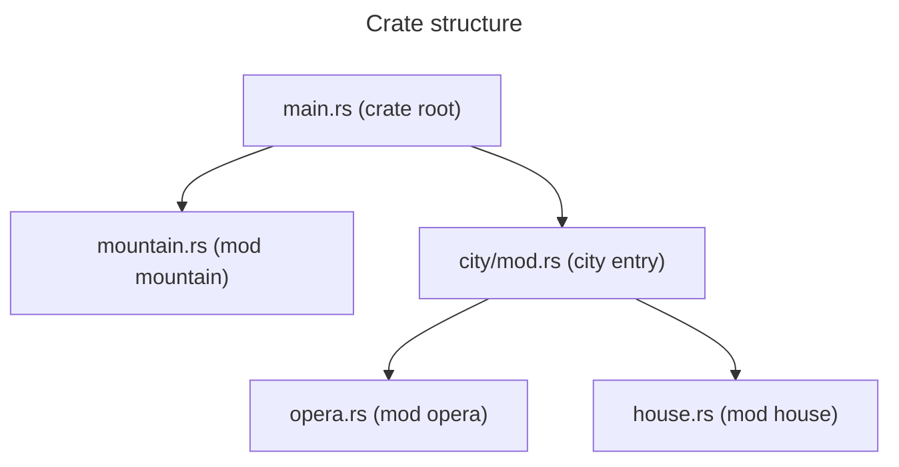

* TOC
{:toc}


Go to the [practical exercise](./HWRust.md).





This Rust introduction class is approximatively following the structure of the official [Rust book](https://doc.rust-lang.org/stable/book/){:target="_blank"}



## Rust in brief

Rust is a general-purpose programming language:

* typed
* compiled
* from low level to high abstraction level

Rust supports multiple programming paradigms.

It is noted for its emphasis on:

* performance
* type safety
* concurrency
* memory safety

### Insights (2025)

Rust exists since 2012, and is [in the top 20 of the most popular programming languages in 2025](https://spectrum.ieee.org/top-programming-languages-2025){:target="_blank"}.

260 665 crates (libraries and binaries) in the [crates.io](https://crates.io/){:target="_blank"} index (official Rust package index).

In 2025: [Rust development was announced becoming an official part of the Linux kernel development](https://en.wikipedia.org/wiki/Rust_for_Linux){:target="_blank"}.

### Modern user-friendly framework

Use of the tool `cargo` to compile, run, lint and test the code, manage dependencies and auto-producing documentation. It is also extensible.

Pieces of codes are shared in the form of *crates*, with an official crates index: <https://crates.io/>, which the default index `cargo` is looking for to install dependencies.

Strong conventions, implemented in the default linter `clippy` (get the linter result with `cargo check`).

## Startup - begin a new project



You will manipulate Cargo in the [practical exercises](./HWRust.md) to create and manage your project.




```sh
cargo new my-project
cd my-project
ls -al
```

```sh
📂 my-project
├── 📂 src # source code directory
│   └── 📄 main.rs # main entry point (reserved module)
└── 📄 Cargo.toml # project metadata (name, version, dependencies, etc.)
```

```sh
cat src/main.rs
```

```rs
fn main() {
  println!("Hello, world!");
}
```

Build the project:

```sh
cargo build
```



Unlike `C` or `C++`, we don't need to write the compilation rules in a Makefile, as these are automatically handled by the Rust compiler.

Also, Cargo provides a build process for a release code: `cargo build --release` (longer compilation time but for better performances).




Run the built target:

```sh
cargo run
```

```text
Hello, world!
```

## Declaring variables

With the `let` keyword:

```rs
//! src/main.rs
//!
//! This is a block of inner line doc comments for the main module (note the "!").

/// The main function.
///
/// This is a block of outer line doc comments associated with the next item (here the function `main`).
/// Doc comments can be organized with section like the example below.
///
/// # Example
///
/// ```rs
/// main();
/// ```
fn main() {
    // A line comment
    let x = 5; // by default a signed integer on 32bits (i32)
    println!("The value of x is: {}", x);

    let y: u8 = 10; // types are specified after the `:` token
    println!("The value of y is: {y}"); // we can also directly put the variable in the placeholder
    println!("Sum of y + 2 is: {}", y + 2); // but an expression must be outside the placeholder
}
```



`println!` is a *macro* to print to the standard output.
A macro is a piece of code that is expanded at the compilation time, i.e. code that writes code.
`println!` is what we call a function-like macro, but it is not a function.




### Mutable variables

By default, a variable is immutable. If we want later to change it, we need to use the `mut` keyword:

```rs
fn main() {
    let mut x = 5;
    assert_eq!(x, 5); // a new macro to assert the equality between two values!
    x = 6;
    assert_eq!(x, 6);
}
```

### Some common types

We can reuse the variable name to store a different type, but we must use the `let` keyword again:

```rs
fn main() {
    let x: f64 = 5.0; // a float (on the stack)

    let x: bool = true; // a boolean (on the stack)

    let x: char = 'h'; // a character (on the stack)
    let x: &str = "hello"; // a litteral string (on the stack)
    let x: String = String::from("hello"); // a string (on the heap)

    let x: [i32; 3] = [1, 2, 3]; // an array of fix size (on the stack)
    let x: Vec<i32> = Vec::from([1, 2, 3]); // a vector (on the heap)
    let x: Vec<i32> = vec![1, 2, 3]; // the same vector using the `vec!` macro (always on the heap)

    let x: (i32, &str, bool) = (1, "hello", true); // a tuple: known number of elements with heterogenous types (here on the stack)
    let x: (i32, String, bool) = (1, String::from("hello"), true); // a tuple (here on the heap)
}
```

## Functions

Rust supports the functional programming paradigm.

In `src/main.rs`, `main` is the first function we have encountered.

To declare a function use the `fn` key word:

```rs
fn print_hello_word() {
    println!("Hello, world!");
}
```

A function can take parameters, as `arg_name: arg_type`:

```rs
fn print_hello_name(name: &str) {
    println!("Hello, {name}!");
}
```

A function can also return a value, where the returned type is specified after the `->` token:

```rs
fn add_one(x: i32) -> i32 {
    x + 1
}
```

In that case, the last line (before the end of the function's scope) does not have a `;` token, it means the value is returned to the caller.
In the case of a premature return, we can use the `return` keyword:

```rs
fn add_one_if_even(x: i32) -> i32 {
    if x % 2 == 0 {
        return x + 1
    }
    x
}
```

## Control flow

As in other languages, Rust can express complex control flows with `if`, `else` conditional, and `while`, `for` loops, but also `match` etc.

### If expression

Traditional `if` cascade:

```rs
fn main() {
    let number = 6;

    if number % 4 == 0 {
        println!("{number} is divisible by 4");
    } else if number % 3 == 0 {
        println!("{number} is divisible by 3");
    } else if number % 2 == 0 {
        println!("{number} is divisible by 2");
    } else {
        println!("{number} is not divisible by 4, 3, or 2");
    }
}
```

Using `if` in a `let` statement:

```rs
fn main() {
    let condition = true;
    let number = if condition { 5 } else { 6 };

    println!("The value of number is: {number}");
}
```

### Loops

Streamlining conditional loops with `while`:

```rs
fn main() {
    let mut number = 3;

    while number != 0 {
        println!("{number}!");

        number -= 1;
    }
}
```

Looping through a collection with `for`:

```rs
fn main() {
    let v: Vec<i32> = vec![10, 20, 30];

    //
    // Reading without consuming the vector
    //
    for element in v.iter() {
        // or just `for element in &v`
        // element is type `&i32`
        println!("the value is: {element}");
    }
    println!("The vector is: {v:?}");

    //
    // Reading while consuming the vector
    //
    for element in v.into_iter() {
        // or just `for element in v`
        // element is type `i32`
        println!("the value is: {element}");
    }
    // Cannot do that, v has been consumed and does not exist anymore:
    // println!("The vector is: {v:?}");
}
```

But wait, what is the difference between `i32` and `&i32` types, and between `.into_iter()` and `.iter()` methods?

## Rust is memory safe

In `Java` or `Python`, a garbage collector runs in the background to free the unused memory.
In `C` or `C++`, you must allocate and free the memory yourself, with potential memory safety errors:

* [dangling pointers](https://en.wikipedia.org/wiki/Dangling_pointer){:target="_blank"}
* [double free](https://en.wikipedia.org/wiki/Memory_safety#Classification_of_memory_safety_errors){:target="_blank"}

Rust uses no garbage collector and describes strict rules for memory management to avoid memory safety errors.



The Stack and the Heap are two ways of storing data in memory.

**Stack:**

* Fast memory allocation and data query
* The size of the data must be known at the compilation time

**Heap:**

* Slow memory allocation and data query
* Can store data of unknown size




Ownership rules:

* Each value in Rust has an owner.
* There can only be one owner at a time.
* When the owner goes out of scope, the value will be dropped.

These rules exist to:

* Track which parts of code are using which data on the heap
* Minimize duplicate data on the heap
* Automatically clean up unused data on the heap

### A String in memory

Some data have a known size at the compilation time (`i32`, `f64`, `bool`, `char`, `str` - literal strings, etc.) and so they are stored on the stack.

For more complicated type, like `String` or `Vec`, they are stored on the heap.
However, the pointer to their content is stored on the stack:

```rs
let s = String::from("hello");
```



### A scope

```rs
{                                  // x and s are not valid here, since they are not yet declared

    let x = 5;                     // x is valid from this point forward
    let s = String::from("hello"); // s is valid from this point forward

}                                  // this scope is now over, and x and s are no longer valid
```

At the end of the scope:

1. Free the memory of `x`: the integer on the stack is freed
2. Free the memory of `s`: the String content on the heap is freed, then the String "metadata" on the stack is freed.

### Moving

A move is a transfer of ownership from one variable to another ~ *there can only be one owner at a time*:

```rs
let s1 = String::from("hello"); // before the move
let s2 = s1;                    // after the move
println!("{}", s2);             // OK
// println!("{}", s1);          // error: borrow of moved value
```

### Copy data

If you want to "deeply copy" the data, if the data is on the heap, you have to clone it (expensive):

```rs
let s1 = String::from("hello");
let s2 = s1.clone();
println!("{}", s1);
println!("{}", s2);
```



Scalar types with known size at compilation time implement the `Copy` trait: instead of being moved, they are copied (cheap operation):

```rs
let x = 5;
let y = x;
println!("x = {}", x); // OK
println!("y = {}", y); // OK
```

### Reference and borrowing

This is one of the core feature of Rust.
Take the example of `String` and a function.

Because of the move rule:

```rs
fn takes_ownership(some_string: String) {
    println!("This is the string: {}", some_string);
}

fn main() {
    let s = String::from("hello");
    takes_ownership(s);
    // s is no longer valid here
}
```

If we want to reuse `s`, we can do that:

```rs
fn takes_ownership_and_gives_back(some_string: String) -> String {
    println!("This is the string: {}", some_string);
    some_string
}

fn main() {
    let s = String::from("hello");
    let s = takes_ownership_and_gives_back(s);
    println!("s = {}", s);
}
```

It gets complicated if we have many parameters we want to reuse after, for example:

```rs
fn get_length(some_string: String) -> (String, usize) {
    let len = some_string.len();
    (some_string, len)
}

fn main() {
    let s1 = String::from("hello");
    let (s2, len) = get_length(s1);
    println!("s = {}, len = {}", s2, len);
}
```

References enable borrowing a value without taking ownership:

```rs
fn get_length(some_string: &String) -> usize {
    some_string.len()
}

fn main() {
    let s = String::from("hello");
    let len = get_length(&s);
    println!("s = {}, len = {}", s, len);
}
```

Note the `&` before the type: this is a reference to the value (the type is `&String`).



Type `&String` is a read-only reference to a String.
If we want to borrow a mutable reference, we need to use `&mut`:

```rs
fn change(some_string: &mut String) {
    some_string.push_str(", world");
}

fn main() {
    let mut s = String::from("hello");
    change(&mut s);
    println!("s = {}", s);
}
```

But with great power comes great responsibility!
If you create two mutable references, the compiler will fail.
In fact, the compiler cannot ensure the validity of all the references if at least one is used to modify the data (race condition, caching problem, etc.).

The rule is thus the following: you cannot create another reference (mutable or immutable) in the same scope if you already have a mutable reference.



See also [Rust Book - Understanding Ownership](https://doc.rust-lang.org/stable/book/ch04-00-understanding-ownership.html){:target="_blank"} chapter.




## Using Structs to structure related data

```rs
/// Use the `struct` keyword to define a structure
///
/// It has two attributes: a width and a height
struct Rectangle {
    width: u32, // The comma is `,` and not the `;` token
    height: u32,
}

// Use the `impl` keyword to implement methods and associated functions on the structure:

impl Rectangle {
    /// A method
    fn area(&self) -> u32 {
        self.width * self.height
    }

    fn set_width(&mut self, new_width: u32) {
        self.width = new_width;
    }

    /// An associated function
    fn new(width: u32, height: u32) -> Self {
        Rectangle { width, height }
    }
}

// You can also declare external function:

fn print_area(rect: &Rectangle) {
    println!("The area of the rectangle is {}.", rect.area());
}

fn main() {
    let rec = Rectangle {
        width: 30,
        height: 50,
    };
    print_area(&rec);

    let mut rec2 = Rectangle::new(30, 50); // The same rectangle but using the constructor we have defined
    print_area(&rec2);

    rec2.set_width(10);
    print_area(&rec2);
}
```

## Enums and matching

Enums are used to define a type with different variant. You can see it as a union of different types.

To declare an enum, use the `enum` keyword:

```rs
enum Color {
    Red, // not the `;` token
    Green,
    Blue,
}

fn main() {
    let red = Color::Red;
}
```

An enum can contain variants of different types:

```rs
enum Stuff {
    Red,
    Number(u32),
    Shape(Rectangle),
}

fn main() {
    let red = Stuff::Red;
    let x = Stuff::Number(10);
    let rect = Stuff::Shape(Rectangle::new(10, 20)); // if we reuse our Rectangle structure
}
```

### Matching

```rs
enum StuffName {
    Red,
    Number,
    Shape,
}

enum Stuff {
    Red,
    Number(u32),
    Shape(Rectangle),
}

fn create_enum(stuff_name: StuffName) -> Stuff {
    match stuff_name {
        StuffName::Red => Stuff::Red,
        StuffName::Number => Stuff::Number(10),
        StuffName::Shape => Stuff::Shape(Rectangle::new(10, 20)), // if we reuse our Rectangle structure
    }
}

fn main() {
    let stuff = create_enum(StuffName::Red);

    match stuff {
        Stuff::Red => println!("Red"),
        Stuff::Number(x) => println!("Number: {}", x),
        Stuff::Shape(rect) => println!("Shape: {}x{}", rect.width, rect.height),
    }

}
```

### The Option enum

The `Option` enum is used to represent the absence of a value.
It has two variants, `Some(T)` and `None`, where `T` is any type.
`Option` is directly accessible from the standard library:

```rs
fn main() {
    let x: u32 = 2;
    let y: Option<u32> = Some(40);

    match y {
        Some(y) => println!("Can do the sum x + y = {}", x + y),
        None => println!("Cannot do the sum x + y"),
    }
}
```



See also the [Rust Book - Recoverable Errors with `Result`](https://doc.rust-lang.org/stable/book/ch09-02-recoverable-errors-with-result.html){:target="_blank"} chapter.




## Structuring a project

### Vocabulary

* **Packages:** A Cargo feature that lets you build, test, and share crates
* **Crates:** A tree of modules that produces a library or executable
* **Modules and `use`:** Let you control the organization, scope, and privacy of paths
* **Paths:** A way of naming an item, such as a struct, function, or module

### Managing a Rust project with Cargo

Creating a new project:

```bash
cargo new my-project
```

Produces:

```sh
📂 my-project
├── 📂 src # source code directory
│   └── 📄 main.rs # main entry point (reserved module)
└── 📄 Cargo.toml # project metadata (name, version, dependencies, etc.)
```

### Modules and visibility levels

When the code is growing, we would like to separate logics into different modules.

For example:

```sh
📂 my-project
├── 📂 src
│   ├── 📄 main.rs
│   ├── 📄 mountain.rs # module mountain
│   └── 📂 city # the city contains may independant logics
│       ├── 📄 mod.rs # city module entry point (the module name is `city`)
│       ├── 📄 opera.rs
│       └── 📄 house.rs
└── 📄 Cargo.toml
```

Let's visit the module from a bottom-up view:



By default, any functions, structures, etc. are private and only their module can access them.
To enable the use outside their module, we have to use the `pub` keyword:

In `src/mountain.rs`:

```rs
pub struct Mountain {
    name: String,
    height: u32,
}

impl Mountain {
    pub fn new(name: String, height: u32) -> Self { ... }
    /// Public getters can be used by any crate
    pub fn name(&self) -> &str { ... }
    pub fn height(&self) -> u32 { ... }
}
```

In `src/city/house.rs`:

```rs
pub struct House { ... }

impl House {
    pub fn new(inhabitants: u32) -> Self { ... }
    pub fn inhabitants(&self) -> u32 { ... }
}
```

In `src/city/opera.rs`:

```rs
pub struct Opera { ... }

impl Opera {
    pub fn new(name: String) -> Self { ... }
    pub fn name(&self) -> &str { ... }
}
```

In order to consider a module in the crate, we have to declare its existence by the `mod` keyword:

In `src/city/mod.rs`:

```rs
//! The opera and house modules are private module
//! and can be used only in the module that declares them
//! i.e. in city/mod.rs (module city)
mod opera;
mod house;

// As the module `house` is declared, we can directly use the `House` structure with `house::House`
// If we want to import directly `House` without everytime writting `house::House` we can do:
use house::House;

pub struct City { ... }

impl City {
    pub fn new(name: String) -> Self { ... }

    pub fn set_opera(&mut self, name: String) { ... }

    pub fn add_house(&mut self, number_of_inhabitants: u32) { ... }

    pub fn opera(&self) -> Option<&opera::Opera> { ... }

    pub fn houses(&self) -> &Vec<House> { ... }
}
```



To make the `City` code more idiomatic, instead of creating an empty `City` and then adding the opera and the houses, a more idiomatic way is to create a builder type, see: [Rust Design Patterns - Creational - Builder](https://rust-unofficial.github.io/patterns/patterns/creational/builder.html){:target="_blank"} section.




In `src/main.rs`:

```rs
mod city;
mod mountain;

fn main() {
    println!("Hello, world!");

    // Use `::` to access an element in the city module's scope
    let mut city = city::City::new("Simcity".to_string());
    city.set_opera("The Opera".to_string());
    city.add_house(4);

    match city.opera() {
        Some(opera) => println!("The Opera is {}", opera.name()),
        None => println!("There is no Opera"),
    }

    for (numero, house) in city.houses().iter().enumerate() {
        println!("House {numero} has {} inhabitants", house.inhabitants());
    }

    // Cannot do this because module city::house is private and only city can access it
    // let a_house: city::house::House;
}
```



There are other visibility levels such as `pub(super)` and `pub(crate)`.
See the [Rust Cheat Sheet - Organizing Code](https://cheats.rs/#organizing-code){:target="_blank"}.




## Unit testing

Rust elegantly supports unit testing.
To test elements of a module, just create a private inner module, like:

`src/rectangle.rs`:

```rs
struct Rectangle {
    width: u32,
    height: u32,
}

impl Rectangle {
    fn new(width: u32, height: u32) -> Self {
        Rectangle { width, height }
    }

    fn area(&self) -> u32 {
        self.width * self.height
    }
}

#[cfg(test)] // required to define a test module
mod tests {
    use super::*; // to import elements from the parent module

    #[test] // required to define a test function
    fn area() {
        let rec = Rectangle::new(10, 20);
        assert_eq!(rec.area(), 200);
    }
}
```

Then you can run the tests with the `cargo test` command.
The `#[cfg(test)]` attribute at the top of the `tests` module tells the compiler to not include the tests in the final binary.



Refer to the Rust book chapter on [unit tests](https://doc.rust-lang.org/stable/book/ch11-03-test-organization.html#unit-tests){:target="_blank"}.




## Traits and generics

### Defining Shared Behaviour with Traits

Both the rectangle and the circle have a perimeter:

```rs
struct Rectangle {
    width: u32,
    height: u32,
}

struct Circle {
    radius: f32,
}

trait Perimeter {
    fn perimeter(&self) -> f32;
}

impl Perimeter for Rectangle {
    fn perimeter(&self) -> f32 {
        2.0 * (self.width + self.height) as f32
    }
}

impl Perimeter for Circle {
    fn perimeter(&self) -> f32 {
        2.0 * std::f32::consts::PI * self.radius
    }
}

fn print_perimeter(shape: &impl Perimeter) {
    println!("The perimeter is {}", shape.perimeter());
}

fn main() {
    let rec = Rectangle {
        width: 10,
        height: 20,
    };
    print_perimeter(&rec);

    let circle = Circle { radius: 10.0 };
    print_perimeter(&circle);
}
```

Some traits can be *derived* i.e. implemented automatically for a given type.

Examples:

* The `Clone` trait: to be able to clone an instance of your structure
* The `PartialEq` trait to be able to compare two instances of your structure with `==` and `!=`

```rs
#[derive(PartialEq, Clone)]  // The derive macro is a procedural macro
struct Rectangle { ... }

fn main() {
    let rec1 = Rectangle { ... };
    let rec2 = rec1.clone(); // method `clone` exists because `Rectangle` implements the `Clone` trait
    assert!(rec1 == rec2); // it works because `Rectangle` implements the `PartialEq` trait
}
```



See the [Rust Book - Defining Shared Behavior with Traits](https://doc.rust-lang.org/stable/book/ch10-02-traits.html){:target="_blank"} chapter.




### Generics

In the above code we can change the function `print_perimeter`:

```rs
fn print_perimeter(shape: &impl Perimeter) {
    println!("The perimeter is {}", shape.perimeter());
}
```

to:

```rs
fn print_perimeter<T: Perimeter>(shape: &T) {
    println!("The perimeter is {}", shape.perimeter());
}
```

This means that a generic type `T` must implement the trait `Perimeter`.

So what is the difference?
In that simple example, nothing.
But in the following:

```rs
fn print_perimeter_of_same_types<T: Perimeter>(shape_a: &T, shape_b: &T) { ... }

fn print_perimeter_of_different_types(shape_a: &impl Perimeter, shape_b: &impl Perimeter) { ... }

/// Same as above with another way of declaring generic bounds
fn print_perimeter_of_different_types_prime<T, U>(shape_a: &T, shape_b: &U)
where
    T: Perimeter, // the where clause is usefull if T or U must implement a lot of traits
    U: Perimeter,
{ ... }


fn main() {
    let rec_a = Rectangle { ... }
    let rec_b = Rectangle { ... }
    let circle = Circle { ... }

    print_perimeter_of_same_types(&rec_a, &rec_b);
    print_perimeter_of_different_types(&rec_a, &circle);

    // Cannot do that, because `Rectangle` and `Circle` are two different types:
    // print_perimeter_of_same_types(&rec_a, &circle);
}
```

Actually, we have already seen the use of generics with vectors `Vec<T>`:

```rs
let v_of_ints: Vec<i32> = Vec::new();
let v_of_strings: Vec<String> = Vec::new();
```

Another useful type from the standard library is `HashMap<K, V>`

```rs
use std::collections::HashMap; // Require to import the `HashMap` type

fn main() {
    // Same for HashMap<K, V>
    let map_of_ints: HashMap<String, i32> = HashMap::new();
    // Same but without declaring the type:
    let map_of_ints = HashMap::<String, i32>::new();
}
```


See also [Rust Book - Generics](https://doc.rust-lang.org/stable/book/ch10-01-syntax.html){:target="_blank"} chapter.



## Resources

The following hyperlinks provide to open resources to learn idiomatic Rust.

`*` Beginner

`**` Intermediate

`***` Advanced

Standard library: <https://doc.rust-lang.org/std/index.html>{:target="_blank"}

### Packages and libraries indices

* [crates.io](https://crates.io/){:target="_blank"} - Official crates index
* [lib.rs](https://lib.rs/){:target="_blank"} - Semi-curated crates index
* [blessed.rs/crates](https://blessed.rs/crates){:target="_blank"} - Recommended crate directory

### Learning

* `*` [The Rust book](https://doc.rust-lang.org/stable/book/){:target="_blank"}
* `*` [Rust by example](https://doc.rust-lang.org/rust-by-example/){:target="_blank"}
* `*` [The Rust Cookbook](https://rust-lang-nursery.github.io/rust-cookbook/){:target="_blank"} - a collection of simple examples highlighting good practices to accomplish common programming tasks in Rust
* `*` [The Cargo book](https://doc.rust-lang.org/cargo/){:target="_blank"}
* `*` [The rustdoc book](https://doc.rust-lang.org/rustdoc/){:target="_blank"}
* `**` [Rust Design Patterns](https://rust-unofficial.github.io/patterns/){:target="_blank"}
* `***` [The Rustonomicon](https://doc.rust-lang.org/nomicon/){:target="_blank"} - The dark arts of advanced and unsafe rust programming
* `***` [The Rust Performance Book](https://nnethercote.github.io/perf-book/title-page.html){:target="_blank"}

### Conventions and idiomatic

* `*` [Rust cheat sheet](https://cheats.rs/){:target="_blank"}
* `*` [Idiomatic Rust](https://github.com/mre/idiomatic-rust){:target="_blank"} - awesome-like list
* `*` [Rust API guidelines](https://rust-lang.github.io/api-guidelines/){:target="_blank"}
* `*` [Canonical's Rust best practices](https://canonical.github.io/rust-best-practices/){:target="_blank"}
* `**` [Rust Design Patterns](https://rust-unofficial.github.io/patterns/){:target="_blank"}
* `**` [Elements of Rust](https://github.com/ferrous-systems/elements-of-rust){:target="_blank"} - Software engineering techniques

### Selection of `cargo` extensions

* [`clippy`](https://github.com/rust-lang/rust-clippy){:target="_blank"} - code linter with for idiomatic code
* [`cargo-nextest`](https://nexte.st/){:target="_blank"} - a next-generation test runner for Rust
* [`cargo-llvm-cov`](https://github.com/taiki-e/cargo-llvm-cov){:target="_blank"} - easily use LLVM source-based code coverage
* [`cargo-release`](https://github.com/crate-ci/cargo-release){:target="_blank"} - release workflow (auto validating-versioning-publishing)

### Blog posts and Tutorials

* [Tangram Vision - Making Great Docs with Rustdoc](https://www.tangramvision.com/blog/making-great-docs-with-rustdoc){:target="_blank"}
* [MMAP(Blog) - Designing error types in Rust](https://mmapped.blog/posts/12-rust-error-handling){:target="_blank"}

### YouTube

* `*` [No Boilerplate Rust videos](https://www.youtube.com/watch?v=Q3AhzHq8ogs&list=PLZaoyhMXgBzoM9bfb5pyUOT3zjnaDdSEP){:target="_blank"} - Peaceful YouTube playlist about Rust
* `*` [Jack O'Connor - A Firehose of Rust for busy people who know C++](https://www.youtube.com/watch?v=IPmRDS0OSxM){:target="_blank"}
* `**` [Jon Gjenset - The "Crust of Rust" Series](https://www.youtube.com/watch?v=rAl-9HwD858&list=PLqbS7AVVErFiWDOAVrPt7aYmnuuOLYvOa){:target="_blank"}
